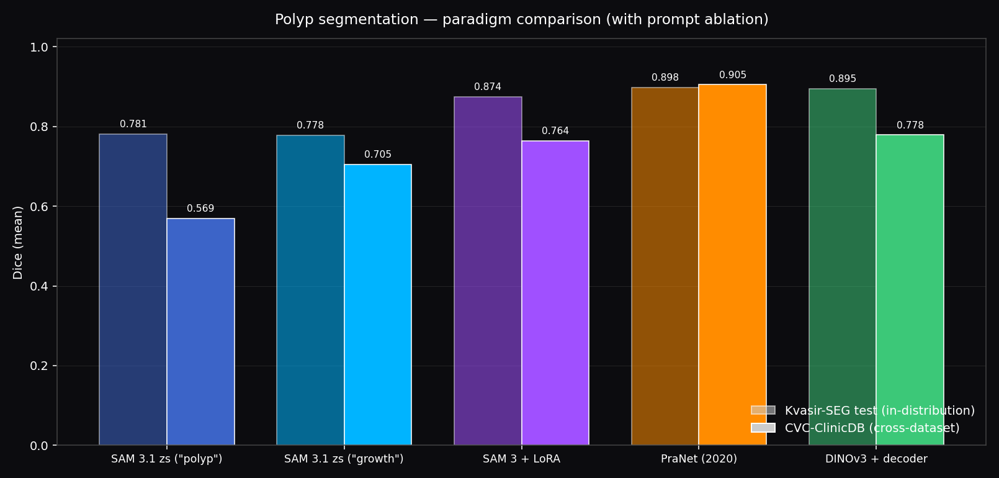
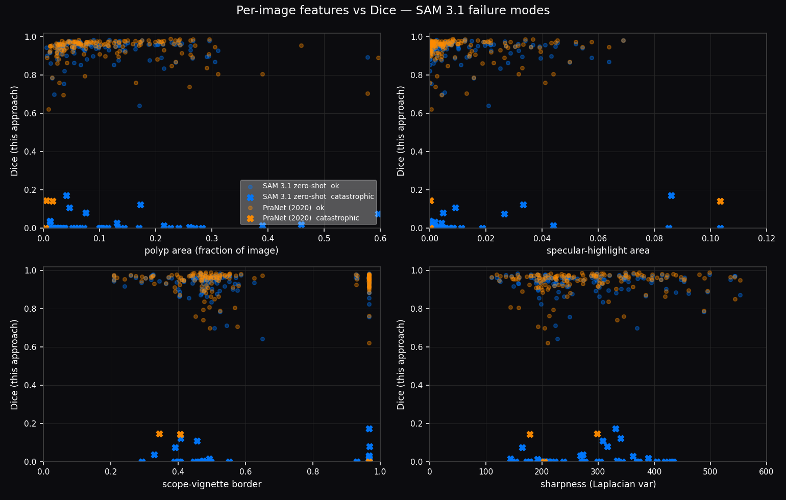
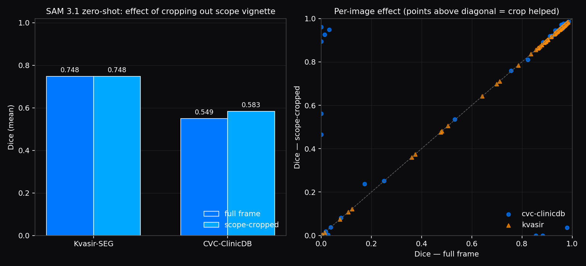
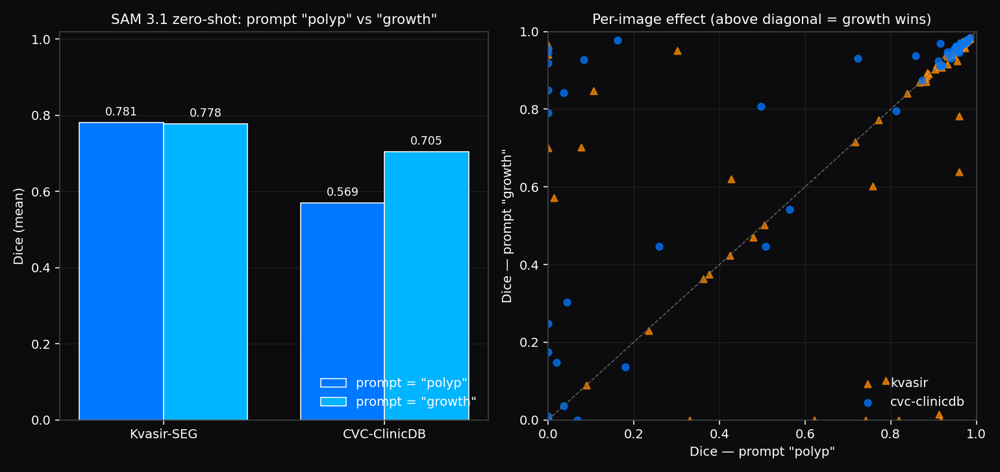
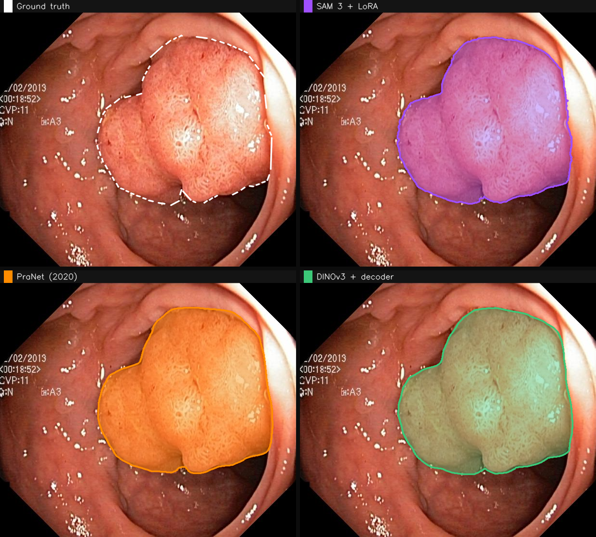

# GutCheck

**Do cutting-edge vision foundation models actually help medical imaging?**

A two-week exploration comparing four paradigms on colonoscopy polyp segmentation:

- **SAM 3.1** (Meta, March 2026) — text-promptable foundation model
- **SAM 3.1 + LoRA** — the same model, adapted with 900 labeled images
- **DINOv3 + decoder** (Meta, 2025) — self-supervised backbone + small segmentation head
- **PraNet** (MICCAI 2020) — purpose-built specialist, the incumbent

Trained on Kvasir-SEG, tested on the standard Kvasir test split (100 images) and cross-dataset on CVC-ClinicDB (62 images). Ran on a single H100.



## Headline results

| Approach | Kvasir-SEG Dice | CVC-ClinicDB Dice | FPS (H100) |
|----------|----------------:|------------------:|-----------:|
| SAM 3.1 zero-shot, prompt `"polyp"`  | 0.781 | 0.569 | 16 |
| **SAM 3.1 zero-shot, prompt `"growth"`** | **0.778** | **0.705** | 16 |
| SAM 3 + LoRA (10 epochs, 900 images) | 0.874 | 0.764 | 11 |
| DINOv3 + trained decoder | 0.895 | 0.778 | 54 |
| PraNet (2020 pretrained) | **0.898** | **0.905** | 54 |

Key observations:

1. **On cross-dataset generalization, the 2020 specialist still wins cleanly.** PraNet at 0.905 Dice beats every 2025/2026 model, including LoRA fine-tuning.
2. **PraNet is also ~3× faster** than any SAM variant on the same hardware (54 FPS vs 16 FPS).
3. **Swapping the SAM 3.1 prompt from `"polyp"` to `"growth"` gains +13.5 Dice points on CVC-ClinicDB** with zero other changes. This is a bigger lift than any preprocessing trick we tried.

## Two findings worth reading

### 1. SAM 3.1 fails on scope-vignette framing, not on hard polyps

SAM 3.1's mean/median Dice gap on CVC-ClinicDB (0.549/0.883) is driven by a specific failure mode: colonoscopy images with a dominant black vignette around a circular scope view. Of SAM 3.1's 42 catastrophic failures (Dice < 0.2), only 2 are also catastrophic for PraNet. The dominant predictor of failure is `scope_border_frac` (Pearson r = −0.31).



Confirmatory intervention — cropping out the vignette — rescued **5 of 25** CVC catastrophic failures (+3.4 mean Dice):



Full writeup: [`docs/FINDING_scope_vignette.md`](docs/FINDING_scope_vignette.md).

### 2. One word changes everything: `"growth"` vs `"polyp"`

Swapping the text prompt from `"polyp"` to `"growth"` — with identical preprocessing, post-processing, and TTA — gains **+13.5 Dice points on CVC-ClinicDB** and is a strict dominance: 12 images helped by >0.2 Dice, **0 hurt by >0.2**.



No other synonym we tried worked. `"tumor"` crashed to 0.36; `"lesion"` to 0.15; `"bump"` to 0.37. The effect is specific to `"growth"`, not to "any non-medical word." Hypothesis: SAM 3.1's open-vocabulary text encoder sees `"growth"` orders of magnitude more often than `"polyp"` in its natural-image caption corpus. The word carries the geometric "protrusion/bump" prior we need; the medical term does not.

Full writeup: [`docs/FINDING_prompt_growth.md`](docs/FINDING_prompt_growth.md).

## Example comparison

Every approach run on the same test image, overlays color-coded per approach. Ground truth is the white dashed outline. Blue = SAM 3.1 zero-shot, purple = SAM + LoRA, orange = PraNet, green = DINOv3 + decoder.



## Failure gallery

Twelve cases where SAM 3.1 fails catastrophically but PraNet handles easily. Layout per row: ground truth | SAM 3.1 | PraNet. The pattern of dark vignette driving SAM failures is visible by eye.


## Repo layout

```
gutcheck/                       # library code
    __init__.py                 # approach palette / labels
    data.py                     # Kvasir-SEG + CVC-ClinicDB loaders
    metrics.py                  # Dice, IoU
    viz.py                      # overlay rendering, grids, heatmaps
    models/
        sam_wrapper.py          # SAM 3 via transformers.Sam3Model + LoRA
        dinov3_seg.py           # DINOv3 ViT-L + MLP decoder head
        pranet.py               # PraNet repo wrapper

scripts/
    eval_sam_zeroshot.py        # SAM 3 (transformers) zero-shot eval
    eval_sam31_zeroshot.py      # SAM 3.1 (Meta repo) zero-shot eval — with all the keeps baked in
    train_sam_lora.py           # LoRA on SAM 3 mask decoder
    eval_sam_lora.py            # eval with LoRA adapters loaded
    eval_pranet.py              # PraNet-19 eval
    train_dinov3.py             # DINOv3 + decoder training
    eval_dinov3.py              # DINOv3 + decoder eval
    failure_analysis.py         # per-image feature correlation + failure gallery
    scope_crop_intervention.py  # confirmatory experiment for vignette hypothesis
    prompt_ablation.py          # "polyp" vs "growth" paired ablation
    render_comparison_grid.py   # 2×3 side-by-side overlays
    render_agreement_heatmap.py # pixel-agreement heatmap overlays
    render_prompt_ablation.py   # prompt-ablation charts
    render_intervention_chart.py# scope-crop intervention chart
    summary_plot.py             # original headline chart
    _run_experiment.sh          # one auto-research iteration on the pod

docs/
    FINDING_scope_vignette.md
    FINDING_prompt_growth.md
    images/                     # the visuals used in this README

research.json                   # auto-research config
results.tsv                     # full auto-research experiment log
```

## Reproduce

Need an NVIDIA GPU (tested on H100 80GB), ~5 GB VRAM per approach at inference, ~20 GB during LoRA training.

```bash
# One-time pod setup (on a fresh Ubuntu 22.04 + CUDA 12.x box)
pip install torch==2.4.1 --index-url https://download.pytorch.org/whl/cu124
pip install 'transformers>=5.5' peft accelerate huggingface_hub safetensors \
    opencv-python-headless albumentations timm pandas matplotlib tqdm gdown

# SAM 3.1 needs its own Python 3.12 env + the Meta repo
python3.12 -m venv sam31env
source sam31env/bin/activate
pip install torch==2.10.0 --index-url https://download.pytorch.org/whl/cu128
git clone https://github.com/facebookresearch/sam3.git && pip install -e sam3
pip install 'numpy<2' einops pycocotools omegaconf hydra-core opencv-python-headless peft pandas matplotlib tqdm

# Accept license + log in for the two gated HF repos
huggingface-cli login    # paste your HF token (see security note below)

# Data + checkpoints
bash scripts/download_data.sh              # Kvasir-SEG, CVC-ClinicDB (via PraNet mirror)
huggingface-cli download facebook/dinov3-vitl16-pretrain-lvd1689m --local-dir checkpoints/dinov3-vitl16
huggingface-cli download facebook/sam3.1                          --local-dir checkpoints/sam3.1
huggingface-cli download facebook/sam3                            --local-dir checkpoints/sam3

# PraNet checkpoint (Google Drive)
pip install gdown
git clone https://github.com/DengPingFan/PraNet.git checkpoints/PraNet
gdown 1lJv8XVStsp3oNKZHaSr42tawdMOq6FLP -O checkpoints/PraNet/snapshots/PraNet_Res2Net/PraNet-19.pth
gdown 1FjXh_YG1hLGPPM6j-c8UxHcIWtzGGau5 -O checkpoints/res2net50_v1b_26w_4s.pth

# Run everything
python scripts/eval_sam_zeroshot.py
python scripts/eval_sam31_zeroshot.py
python scripts/eval_pranet.py
python scripts/train_sam_lora.py && python scripts/eval_sam_lora.py
python scripts/train_dinov3.py   && python scripts/eval_dinov3.py

# Analysis
python scripts/failure_analysis.py
python scripts/scope_crop_intervention.py
python scripts/prompt_ablation.py
python scripts/render_prompt_ablation.py
python scripts/summary_plot.py
```

`scripts/_run_experiment.sh` expects `GUTCHECK_POD_HOST` and `GUTCHECK_POD_PORT` env vars; it was used by the auto-research loop to drive experiments against a remote H100 pod via SSH.

## Datasets

Training: Kvasir-SEG (900 images, minus the 100 PraNet test split). Test: PraNet's canonical 100-image Kvasir test set and 62-image CVC-ClinicDB test set. Both test sets are what every PraNet-descendent paper uses, so numbers are directly comparable to published work. Please cite the original dataset papers (Jha et al. 2020 for Kvasir-SEG; Bernal et al. 2015 for CVC-ClinicDB) if you use them.

## Not included

- HyperKvasir raw-video clips for the live-overlay video demo — the 25 GB labeled-videos zip was too heavy for the pod's disk budget; skipped for time.
- Kvasir-Sessile flat-polyp hardcase test. Good candidate for follow-up.
- Temporal consistency on actual video — SAM 3.1's multiplex video predictor wasn't exercised.

## Security notes

- No credentials of any kind are committed. `scripts/_run_experiment.sh` reads the pod host from env vars.
- You'll need a HuggingFace token with access accepted on `facebook/sam3`, `facebook/sam3.1`, and `facebook/dinov3-vitl16-pretrain-lvd1689m` (all gated). Pass via `huggingface-cli login` — don't commit it.
- PraNet weights and CVC-ClinicDB are mirrored on Google Drive — `gdown` is the cleanest path today; see `scripts/download_data.sh` for the exact file IDs.

## License

Code is MIT-licensed (see [`LICENSE`](LICENSE)). Pretrained model weights and datasets retain their original licenses — PraNet and Kvasir-SEG / CVC-ClinicDB are research-use-only, SAM 3.1 and DINOv3 are gated under Meta's own license, SAM 2.1 is Apache-2.0.

## Citations

- Jha et al. 2020. *Kvasir-SEG: A Segmented Polyp Dataset.* MMM.
- Borgli et al. 2020. *HyperKvasir.* Scientific Data.
- Bernal et al. 2015. *CVC-ClinicDB.* Comput. Med. Imaging Graph.
- Fan et al. 2020. *PraNet: Parallel Reverse Attention Network for Polyp Segmentation.* MICCAI.
- Carion, Gustafson, Hu, Debnath, Hu, et al. 2025. *SAM 3: Segment Anything with Concepts.* arXiv:2511.16719.
- Meta 2026. *SAM 3.1 Object Multiplex release notes.*
- Siméoni et al. 2025. *DINOv3.* Meta AI / FAIR.
- Yang et al. 2025. *SegDINO: Efficient Segmentation with DINOv3.* arXiv:2509.00833.
- Zhao et al. 2019. *Magnitude, Risk Factors, and Factors Associated With Adenoma Miss Rate of Tandem Colonoscopy.* Gastroenterology.
